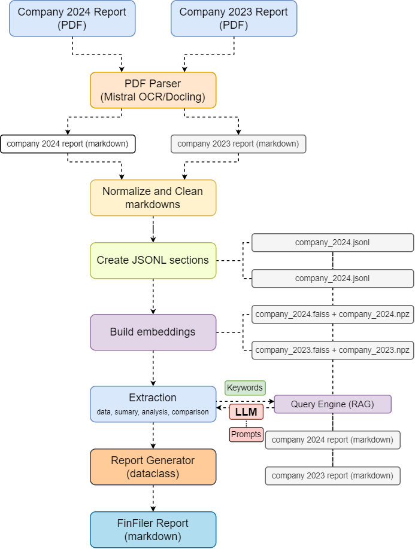

# FinFiler Financial Report Generator - FinDDR 2025 Challenge

## Overview
- Processes company financial statement reports in English, Simplified Chinese, Traditional Chinese, and Indonesian.
- Automatically parses PDFs using Mistral OCR
- Deep analysis of:
  - Innovation and product advantages, reputation ratings, mission and vision statements
  - Income statement, balance sheet, cash flow, and operating performance
  - Profitability, financial performance, business compeitiveness
  - Risk factors, internal controls
  - Strategic direction, challenges and uncertainties, development plans 
- Outputs in a structured report format

<p align="center">
  
</p>

## Repo Structure
```
FinFiler/
├── src/
│   ├── main.py                 
│   ├── extraction.py           
│   ├── mistral_parse.py        
│   ├── embeddings.py            # FAISS-based semantic search
│   ├── report_generator.py      # Output formatting and report generation
│   └── normalize_and_segment.py # Markdown to Jsonl sections preprocessing
├── prompts/
│   ├── prompts.py               # LLM prompt templates
│   └── keywords.yaml            # search query keywords
├── utils/
│   ├── clean_markdown.py       
│   └── check_existing_files.py       
├── artifacts/                   # generated FinFiler reports
├── .env                         # API keys (OpenAI, Mistral)
└── requirements.txt
```

## Installation:

### Prerequisites
- OpenAI API key
- Mistral AI API key

### Step 1: Clone the Repository

```bash
git clone https://github.com/blitzionic/FinFiler.git
cd Finfiler
```
### Step 2: Setup Virtual Environment

```bash
python -m venv .venv

# On Linux/macOS
source .venv/bin/activate

# On Windows
.venv\Scripts\activate
```

### Step 3: Install Dependencies

```
pip install -r requirements.txt
```

### Step 4: Configure API Keys

Create a `.env` file in the project root:

```bash
OPENAI_API_KEY=sk-your-openai-key-here
MISTRAL_API_KEY=your-mistral-key-here
```

## Usage

### Basic Command

```bash
python src/main.py --pdf_2024 <path-to-2024-report.pdf> \
                   --pdf_2023 <path-to-2023-report.pdf> \
                   --lang <EN|ZH_SIM|ZH_TR|IN>
```

The following commands are for extracting from company reports in the specified languages.
If the company report is in Simplfied Chinese, the FinFiler report will also be in Simplified Chinese. 

**English Report:**
```bash
python src/main.py --pdf_2024 company_2024.pdf \
                   --pdf_2023 company_2023.pdf \
                   --lang EN
```

**Simplified Chinese Report:**
```bash
python src/main.py --pdf_2024 company_2024.pdf \
                   --pdf_2023 company_2023.pdf \
                   --lang ZH_SIM
```

**Traditional Chinese Report:**
```bash
python src/main.py --pdf_2024 company_2024.pdf \
                   --pdf_2023 company_2023.pdf \
                   --lang ZH_TR
```

**Indonesian Report (report will be in English):**
```bash
python src/main.py --pdf_2024 company_2024.pdf \
                   --pdf_2023 company_2023.pdf \
                   --lang IN
```


### Output

Generated reports are saved in the `artifacts/` directory:
```
artifacts/
├── FinFiler_report_company1.md     
└── FinFiler_report_company2.md     
└── ....     
```


